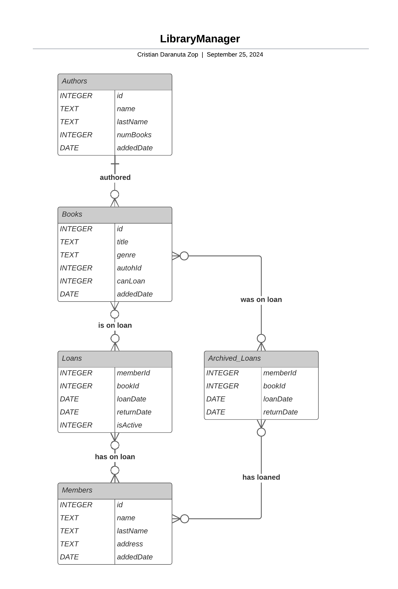

# Design Document

By CRISTIAN DARANUTA ZOP

Video overview: <[LibraryManager CS50SQL  Final Project MrPudin](https://youtu.be/yc0Hu7tm_zY)>

## Scope

* What is the purpose of your database?

    The objective to be implemented in the database is the library management by tracking authors, books, members and book loans. For this purpose, functions are provided to manage the lending process, visualize the availability of books and keep a record of active and historical loans.

* Which people, places, things, etc. are you including in the scope of your database?

    - Authors: Since they are the ones who write books, therefore we would have a record of them to see what books they have written, and their information.

    - Books: As a library, we would have to have the books registered, highlighting important information such as if it is available to be borrowed, which author is the work, and what genre it is.

    - Members: Who would be the members of the library, who would borrow the books.

    - Loans: Which would be a record of the history of loans and whether they are active or have been returned.

* Which people, places, things, etc. are *outside* the scope of your database?

    - Library financial records

    - Inventory of media other than books (DVDs, Magazines,…), but which could be implemented in the future

    - Fines or penalties for overdue returns

## Functional Requirements

* What should a user be able to do with your database?

    - View information about the authors and the books they have written.

    - View the loan status of the books, i.e. see if they are on loan or available.

    - They will be able to consult the borrowing history, whether they are active or not, and even archive the oldest ones.

    - Search for books by genre, title or author.

    - You will be able to see statistics such as the most read books historically or in the last year.

    - You will be able to see new library acquisitions, such as new authors or new books.

* What's beyond the scope of what a user should be able to do with your database?

    - A more detailed tracking of members, beyond their borrowing, such as attendance at library events, record of their activity attending at the library itself…

    - Delete books or authors from the library; once registered, it is not thought that you can delete them.

## Representation

### Entities

* Which entities will you choose to represent in your database?

    - Authors: which, as the name says, are the authors of the books, so queries like finding the books of an author or similar are very important, and you have to have a record of who wrote each book.

    - Books: Books is, so to speak, the main entity. Most operations are based around it, and it is where we store our library inventory.

    - Members: These are the ones that do the book movements, borrowing, looking for information and returning them, so they are, so to speak, the entity that also encompasses most of the users that would access the base, looking for information of authors, information of books and also what state they are in.

    - Loans: Loans are based on two subgroups.
        - Recent loans: Where we store a smaller record of history, and above all the loans that are active, and all the records of the last year are stored; this so that it is not so heavy and to be able to make a query in a faster way, and so we do not have old data that hinder the search.
        - Archived loans: This is basically the same as the loan table, but here are stored the old loans, which we do not want to hinder the speed of searching for information, as they are old loans that are no longer active.

* What attributes will those entities have?

    - Authors:
        - id - As the identifier of each author
        - name - As the author's name
        - lastName - The author's last name
        - numBooks - The number of books the author wrote
        - addedDate - The date the author was added to the database
    - Books:
        - id - As the identifier of each book
        - title - As the books's title
        - genre - The book's genre
        - authorId - The id of the author who published the book
        - canLoan - Variable marking whether the book is available for loan
        - addedDate - The date the book was added to the database
    - Members:
        - id - As the identifier of each member
        - name - As the member's name
        - lastName - The member's last name
        - address - The member's mailing address
        - addedDate - The date the member was added to the database
    - Loans:
        - memberId - The id of the member who made the loan
        - bookId - The id of the book the member loaned
        - loanDate - The date the loan was made
        - returnDate - The date on which the loan ended
        - isActive - Soft delete variable to see if the loan is still active or not
    - Archived_Loans:
        - memberId - The id of the member who made the loan
        - bookId - The id of the book the member loaned
        - loanDate - The date the loan was made
        - returnDate - The date on which the loan ended

* Why did you choose the types you did?

    - Authors:
        - id - INTEGER because it is a natural number as an identifier and we use it as Primary Key
        - name - TEXT because it is a character string
        - lastName - TEXT because it is a character string
        - numBooks - INTEGER since the number of books cannot be decimal, you cannot publish half a book.
        - addedDate - DATE is the date type as we store a date in the variable
    - Books:
        - id - INTEGER because it is a natural number as an identifier and we use it as Primary Key
        - title - TEXT because it is a character string
        - genre - TEXT because it is a character string
        - authorId - INTEGER is a ForeignKey, so it must be of the same type as the author id
        - canLoan - INTEGER which we use as a boolean since it indicates whether it is available or not.
        - addedDate - DATE is the date type as we store a date in the variable
    - Members:
        - id - INTEGER because it is a natural number as an identifier and we use it as Primary Key
        - name - TEXT because it is a character string
        - lastName - TEXT because it is a character string
        - address - TEXT because it is a character string
        - addedDate - DATE is the date type as we store a date in the variable
    - Loans:
        - memberId - INTEGER is a ForeignKey, so it must be of the same type as the member id
        - bookId - INTEGER is a ForeignKey, so it must be of the same type as the book id
        - loanDate - DATE is the date type as we store a date in the variable
        - returnDate - DATE is the date type as we store a date in the variable
        - isActive - INTEGER which we use as a boolean since it indicates whether it is active or not.
    - Archived_Loans:
        - memberId - INTEGER is a ForeignKey, so it must be of the same type as the member id
        - bookId - INTEGER is a ForeignKey, so it must be of the same type as the book id
        - loanDate - DATE is the date type as we store a date in the variable
        - returnDate - DATE is the date type as we store a date in the variable

* Why did you choose the constraints you did?

    - Authors:
        - id - PRIMARY KEY - Then this will always be unique and cannot be NULL
        - name - NOT NULL - We need to have the author's name or pseudonym
        - lastName - DEFAUT NULL - This is because if the author has a pseudonym such as “Miguel de Cervantes”, the last name would not count, everything would be stored in the name column
        - numBooks - DEFAULT 0 CHECK ("numBooks" >= 0) - Because the author when registering, it is assumed that he/she has no books published yet in the library
        - addedDate - DEFAULT (strftime('%Y-%m-%d', 'now')) - It is a default because it would not be necessary to modify the date, when adding the author, it would be set just when it is added in the database
    - Books:
        - id - PRIMARY KEY - Then this will always be unique and cannot be NULL
        - title - NOT NULL - We must have the title of the book
        - genre - NOT NULL - We must have the genre of the book
        - authorId - FOREIGN KEY - Then this will always be unique and cannot be NULL
        - canLoan - DEFAULT 1 CHECK ("canLoan" IN (0,1)) - Used as a boolean to see if the book is available for lending or not
        - addedDate - DEFAULT (strftime('%Y-%m-%d', 'now')) - It is a default because it would not be necessary to modify the date, when adding the book, it would be set just when it is added in the database
    - Members:
        - id - PRIMARY KEY - Then this will always be unique and cannot be NULL
        - name - NOT NULL - We need to have the members's name
        - lastName - NOT NULL - We need to have the members's last name
        - address - NOT NULL - We need to have the members's address
        - addedDate - DEFAULT (strftime('%Y-%m-%d', 'now')) - It is a default because it would not be necessary to modify the date, when adding the member, it would be set just when it is added in the database
    - Loans:
        - memberId - FOREIGN KEY - Then this will always be unique and cannot be NULL
        - bookId - FOREIGN KEY - Then this will always be unique and cannot be NULL
        - loanDate - DEFAULT (strftime('%Y-%m-%d', 'now')) - Since the date when the book was loaned
        - returnDate - DEFAULT NULL - Because the return date has not yet been made, so it is NULL, then it will be updated when the book has been returned
        - isActive - DEFAULT 1 CHECK ("isActive" IN (0,1)) - Used as a boolean to see if the loan is still active or not
    - Archived_Loans:
        - memberId - FOREIGN KEY - Then this will always be unique and cannot be NULL
        - bookId - FOREIGN KEY - Then this will always be unique and cannot be NULL
        - loanDate - NOT NULL - Because in order to archive old loans, they have to have been borrowed, so we need a date
        - returnDate - NOT NULL - Because in order to archive the old loans, they have to have been returned as well, so we need a date

### Relationships

* Relationships:
    - Authors -> Books - Zero to Many - Each author can be registered, but does not have to have any published books in the library, just as you can have many published books
    - Books -> Authors - One to One - Each book is written by an author
    - Books -> Loans/Archived_Loans - Zero to Many - Each book may have been borrowed once, or not at all, or many times
    - Loans/Archived_Loans -> Books - Zero to Many - Each loan can be assigned to zero or many books, although when active, they only relate to one book at the most
    - Members -> Loans/Archived_Loans - Zero to Many - Each member may have either zero loans or many loans, depending on how active they have been
    - Loans/Archived_Loans -> Members - Zero to Many - Each loan likewise relates to either no members or many members, depending on how many loans have been made by each member

## Optimizations

* Which optimizations (e.g., indexes, views) did you create? Why?
    - Indexes
        - Authors: On "name" and "lastName" to speed up the searches by the author names
        - Books:
            - Single indexes on “title” and “genre” for faster book searches
            - Composite Index on "auhtorId" and "canLoan" to optimize searches by book availability
        - Members: Composite index on "name" and "lastName" for more efficient member search
        - Loans:
            - Single Index on "loanDate" to speedUp the queries by date
            - Composite Index:
                - "memberId" and "isActive" to find member's active loans more quickly
                - "bookId" and "isActive" to find book's active loans more quickly
        - Archived Loans: Composite Index on "memberId" and "bookId" for faster queries on the archived loans

    - Triggers
        - update_after_insert_book - Increases the number of books owned by an author
        - set_book_on_loan - Update the status of the book that cannot be loaned
        - set_book_on_return - Updates the status of the book on whether it can be loaned
        - check_if_can_loan
            - Checks that the book can be borrowed, otherwise it displays an error message and aborts the operation
            - Check that the member has no more than 3 books on loan, otherwise an error message is displayed and the operation is aborted
        - delete_member - When a member unsubscribes, it is assumed that he/she returns the books in case he/she has books on loan

    - Views
        - view_authors_and_books_info - Combines Books and Authors info to allow quick querries for information about them
        - view_books_on_loan - View created to consult the books that are already on loan, when they are expected to be returned, and who has them on loan
        - view_available_books - View created to consulty what books you can loan more quickly. For example a web site with the available books
        - view_books_loan_status - View where you can see the status of the book in a clearer way
        - view_member_loan_counts - A view that counts how many books each member has on loan. Only shows members who have any books on loan
        - view_recent_books & view_recent_authors - Views to view new additions to the library (Authors or Books)
        - view_top_100_books_all_time & view_top_100_books_last_year - Views to see statistics on which are the most read books historically or recently

## Limitations

* What are the limitations of your design?
    - Although the system can display loan dates, and expected return dates, it does not explicitly track overdue books or impose fines
    - In the future it could be implemented or expanded to have a larger inventory other than just books

* What might your database not be able to represent very well?
    - It doesn't include more detailed metadata about books, such as publisher, edition, year of publication,...
    - The scalability in case the data handling increases in volume, it would be necessary to think about a format to scale the database as partitioning strategies
